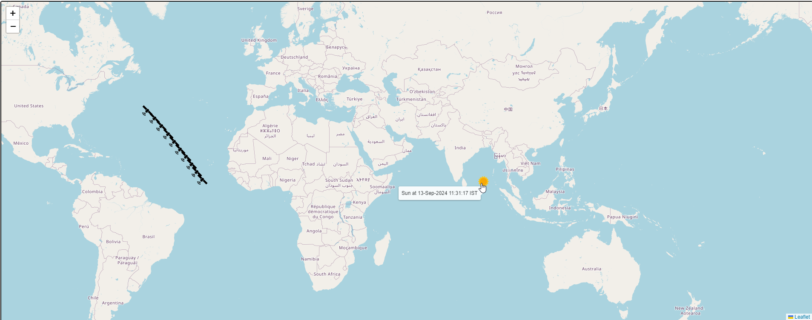

# ISS Tracking App using FastAPI, Leaflet and Python

This repo has the code for a ISS Tracking App. The ISS data is polled from https://wheretheiss.at/w/developer

The below REST API endpoints are exposed

* GET /getISSCoordinates -- Returns the last 10 locations of the ISS

  > Sample returned body is
  > ```
  >[
  >  {
  >    "latitude": 45.740046548685,
  >    "longitude": -174.15209378684,
  >    "timestamp": "12-Sep-2024 18:13:53 IST",
  >    "altitude": 427.74,
  >    "velocity": 27571.55,
  >    "sunLatitude": 3.8632350424651,
  >    "sunLongitude": 348.05265392438
  >  }
  >]
  > ```

  
* GET /showISSMap -- Displays the last 10 locations of the ISS on a Leaflet map

  Sample map <br><br>
  

  Sample map with ISS markers <br><br>
  

  Sample map with Sun markers <br><br>
  


To run it in Dev mode, use the FastAPI run command

```console
fastapi dev .\index.py
```

Once the app is started locally, the below URL's will be available 

```
API Endpoint URL : http://127.0.0.1:8000 
Generated API Docs URL : http://127.0.0.1:8000/docs
```
